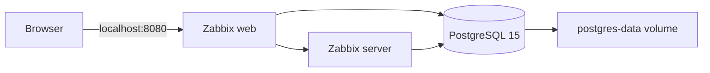

# Zabbix monitoring lab with PostgreSQL

A personal infrastructure lab by Eduardo Branco, using Docker Compose to run a Zabbix server, an Nginx-based web frontend, and PostgreSQL. This repository demonstrates service composition, container networking, persistent storage, and database startup checks. It does not include monitored hosts, templates, dashboards, or measured production results.

## Architecture



Compose uses the published Zabbix images directly; the existing Dockerfile is not used by this configuration. Host ports are bound to loopback for a local lab. Remote agents cannot connect without an intentional network configuration change.

## Run locally

Prerequisites: Git, Docker Engine or Docker Desktop with Linux containers, and Docker Compose v2.

```sh
git clone https://github.com/Ehbranco/zabbix.git
cd zabbix
```

Set a strong database password in the current shell. Do not commit credentials.

PowerShell:

```powershell
$env:ZABBIX_DB_PASSWORD = Read-Host "Local lab database password"
```

Bash:

```bash
read -rsp "Local lab database password: " ZABBIX_DB_PASSWORD
export ZABBIX_DB_PASSWORD
printf "\n"
```

```sh
docker compose config --quiet
docker compose up -d
docker compose ps
docker compose logs --tail=100 postgres zabbix-server zabbix-web
```

Open http://localhost:8080 after schema initialization finishes. On a fresh official Zabbix database, the initial web login is normally `Admin` / `zabbix`; change it immediately. This web login is separate from the database password.

## Validate and troubleshoot

- Missing password: Compose stops before creating services. Set the variable in the same terminal.
- Database readiness: PostgreSQL must pass `pg_isready` before dependent services start. This check is not a full application readiness check.
- Web interface not ready: inspect server/web logs; initial database setup can take time.
- Existing database volume: changing the environment variable does not change an existing PostgreSQL role password. Use the existing password or perform a deliberate database password rotation; preserve and back up the volume.
- Existing installation with fixed container names: stop the old stack with its original Compose file before switching to this configuration.
- Stop without deleting data: `docker compose down`. Avoid `down -v` unless you intend to permanently erase the lab database.

## Scope and next steps

This is a learning environment, not a production deployment. Zabbix images still use the original `latest` tags; pin a mutually compatible, tested release before relying on repeatable deployments. Back up an existing database before pulling newer images. TLS, managed secrets, backup/restore testing, and sample monitored hosts remain future work. Environment variables remove passwords from source code but are still visible to users with Docker access.

Runtime validation is pending; no successful container startup or performance result is claimed here.

## References

- [Zabbix containers](https://www.zabbix.com/documentation/current/en/manual/installation/containers)
- [Compose startup order](https://docs.docker.com/compose/how-tos/startup-order/)
- [Compose variables](https://docs.docker.com/compose/how-tos/environment-variables/variable-interpolation/)

## Author

[Eduardo Castello Branco](https://www.linkedin.com/in/eduardohbranco/) — networks, infrastructure, and cloud labs.
